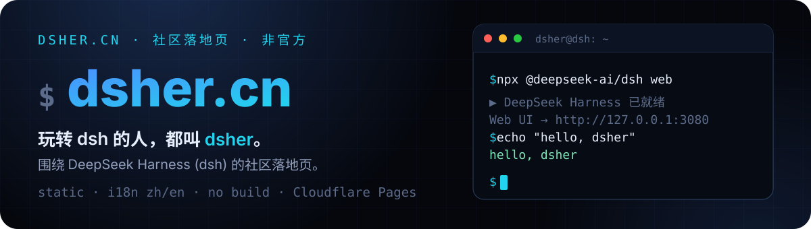
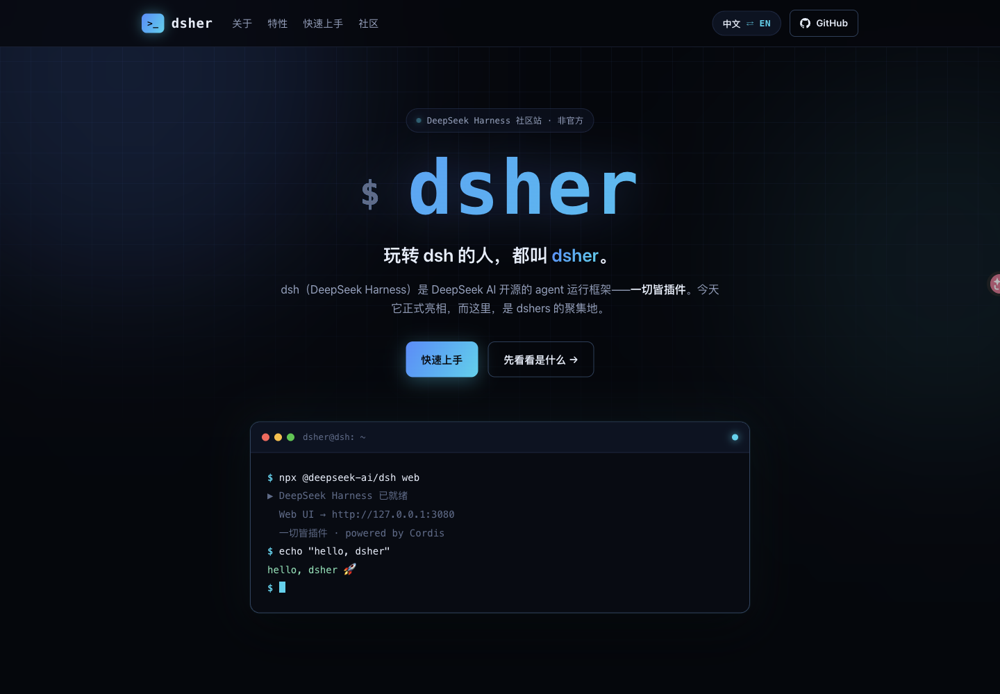

<p align="center">
  
</p>

# dsher.cn

围绕 **DeepSeek Harness (dsh)** 的社区落地页：纯静态、中英双语、深色科技风，可直接部署到 Cloudflare Pages。

> 玩转 dsh 的人，都叫 **dsher**。

🌐 **在线访问：[https://dsher.cn](https://dsher.cn)**

## 预览

<p align="center">
  
</p>

## 这是什么

`dsher` = `dsh` + `er`，就像 hacker 之于 hack——**玩 dsh 的人**。本站给这群人一个落脚点：介绍 dsh 是什么、为什么值得玩、怎么一分钟上手。

页面构建在 Cordis 之上，呼应 dsh 的核心哲学：**一切皆插件**。

## 特性

- **纯静态，零构建** —— 无框架、无依赖、无 `package.json`
- **插件市场** —— 检索、安装 dsh 生态插件（官方/社区/索引，一键复制安装命令）
- **中英双语** —— 右上角一键切换，选择存入 `localStorage`，默认跟随浏览器语言
- **深色科技风** —— 与 dsh 开发者气质一致的终端美学（`$` 提示符、渐变青蓝、细网格）
- **真实内容** —— 特性、命令、社区入口均来自 DeepSeek Harness 官方仓库
- **非官方声明** —— 页脚内置与 DeepSeek AI 无隶属关系的声明

## 快速开始

本地预览：

```sh
cd dsher-site
python3 -m http.server 8080
# 打开 http://127.0.0.1:8080
```

## 项目结构

```
dsher-site/
├── index.html     # 页面结构（中英双语 data-i18n 属性）+ SEO（OG/canonical/JSON-LD）
├── plugins.html   # 插件市场页（搜索 / 筛选 / 一键复制安装命令）+ SEO + ItemList 结构化数据
├── styles.css     # 深色科技风样式
├── plugins.css    # 插件市场样式
├── app.js         # 中英切换 / 复制按钮 / tab / 插件市场渲染
├── favicon.svg    # 站点图标
├── plugins.json   # 插件市场数据（97 个插件，见下方刷新方法）
├── robots.txt     # 搜索引擎抓取规则 + sitemap 声明
├── sitemap.xml    # 站点地图（首页 / 插件市场）
├── scripts/
│   └── update-plugins.py  # 一键刷新社区插件数据（GitHub API）
├── assets/
│   ├── og-image.png      # 社交分享图（1200×630）
│   ├── og.svg            # OG 图的 SVG 源文件
│   └── readme/           # README 视觉素材（hero.svg / preview.png）
```

## 插件市场

[plugins.html](plugins.html) 整合了 dsh 生态的插件：官方内置/示例、社区插件、生态索引，支持按名称/作者/标签搜索、按类型筛选、按 Star 排序，社区插件卡片带一键复制的安装命令（`dsh plugin add github:<owner>/<repo>`）。

**刷新数据**（社区插件的 Star 和描述来自 GitHub，会过时）：

```sh
python3 scripts/update-plugins.py   # 需要网络；走代理时先 export https_proxy
```

## 部署到 Cloudflare Pages

### 方式 A：Git 集成（推荐，push 即部署）

1. 把仓库推到 GitHub（本仓库即为该模式）。
2. [Cloudflare Dashboard](https://dash.cloudflare.com) → **Workers & Pages** → **Create** → 选 **Pages** 标签 → **Connect to Git**，选择 `dsher-site` 仓库。
3. 构建配置（纯静态站的标准写法）：

   | 配置项 | 值 |
   | --- | --- |
   | Build command | `exit 0` |
   | Build output directory | `/` |

   > `exit 0` 是 Cloudflare 官方对无框架静态站的推荐值：Pages 以构建命令的退出码判断成败，`exit 0` 即"无构建步骤，直接上传资源"。

4. 部署后访问 `https://<project>.pages.dev`，再到 **Custom domains** 绑定 `dsher.cn`（DNS 添加 CNAME 指向 `pages.dev` 域名并开启代理）。

> **⚠️ 踩坑提示**：创建项目时务必选 **Pages** 标签，不要走默认的 **Worker** 入口——Worker 流程会要求填 "Deploy command"，部署出来是 `xxx.workers.dev` 域名加默认的 Hello World 模板，完全不读仓库文件。症状：域名后缀是 `workers.dev` 且页面显示 "Hello world"。

### 方式 B：拖拽上传（备用）

1. Workers & Pages → **Create** → **Pages** → **Upload assets**。
2. 把仓库根目录的文件拖进上传区，命名项目，点 Deploy。
3. 同样在 **Custom domains** 绑定 `dsher.cn`。

## 修改文案

所有文案集中在 `app.js` 顶部的 `I18N` 表，以 `data-i18n` 键值对维护中英两份：

```js
"hero.tagline": { zh: "玩转 dsh 的人，都叫 <em>dsher</em>。", en: "People who play with dsh are called <em>dshers</em>." },
```

改文案只需改这一处；想加新文案，在 HTML 里加 `data-i18n="新键"` 并在 `I18N` 补一条即可。

## 免责声明

本站是 dsher 社区的非官方页面，与 DeepSeek AI 无隶属关系。DeepSeek Harness (dsh) 是 DeepSeek AI 的 MIT 开源项目；文中商标归各自所有者所有。
